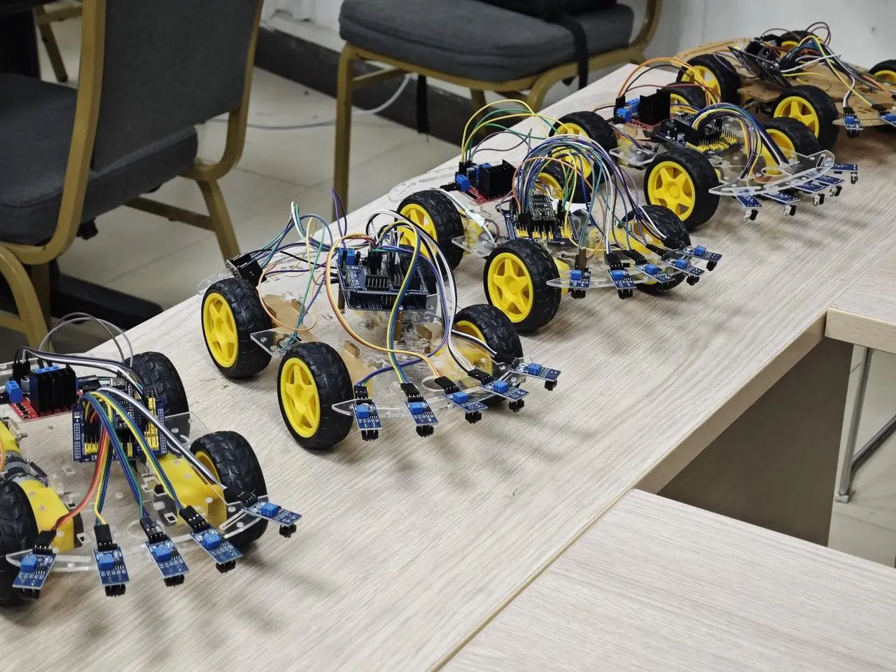
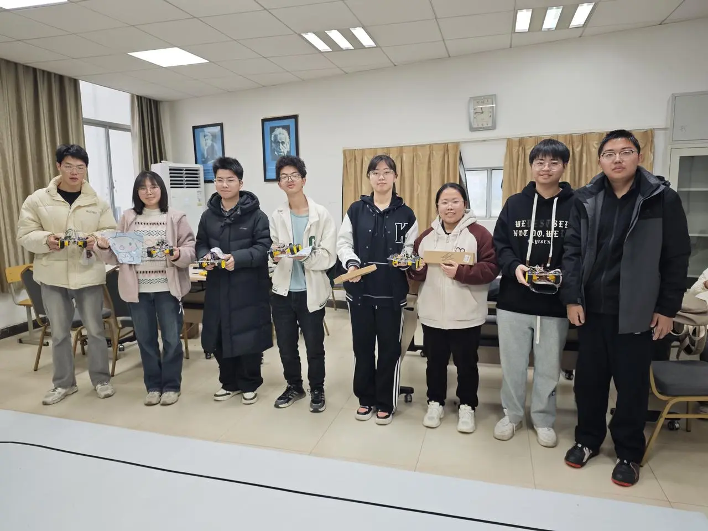
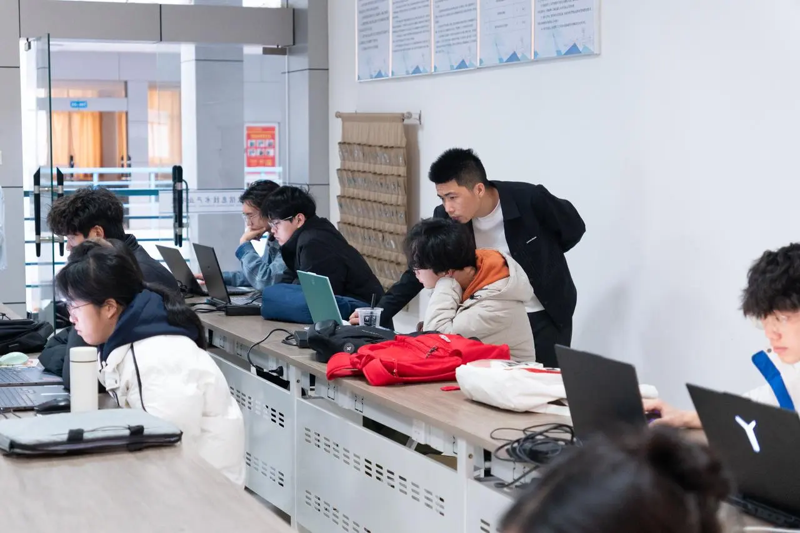

# 🚀 点燃科技热情，共赴创新盛宴！

为激发同学们的科技探索精神，促进技术交流与协作，蓝色技术工作室于 3 月 29 日成功举办两大科技活动——红外循迹小车争霸赛与 AI 智能体项目展！如今圆满落幕，现场氛围火热，创意与智慧激情碰撞，来看看精彩回顾吧！

## 🏆 红外循迹小车争霸赛：速度与智慧的较量

时间地点：3 月 29 日 ｜S5-301

活动亮点：

• 代码调试支持：参与过上期小车制作活动的同学提前时间联系学长学姐优化代码，为比赛做足了准备！当然，学长学姐在现场也作为“智囊团”为他们提供帮助。

• 激烈角逐：各队伍的小车在赛道上飞驰，凭借优秀的循迹算法争夺冠军宝座！

## 🤖 AI 智能体项目展：探索未来智能世界

时间地点：3 月 29 日｜S5-310、S5-312

活动亮点：

• 前沿展示：蓝色技术工作室小伙伴带来智能体技术演示，为大家揭晓 AI 如何赋能生活与创新！

• 互动交流：指导老师现场为学生讲解智能体开发逻辑，激发灵感，为后续智能体比赛储备知识！

## ✨ 活动总结：

本次双线活动不仅为同学们提供了实践与展示的舞台，更在交流中点燃了科技创新的火种🔥。无论是小车赛场的激烈比拼，还是智能体展区的思维碰撞，都展现了蓝色技术工作室“技术赋能未来”的核心理念。感谢每一次创意的交汇， 期待与热爱科技的你们在下次活动中再次开启探索之旅！

