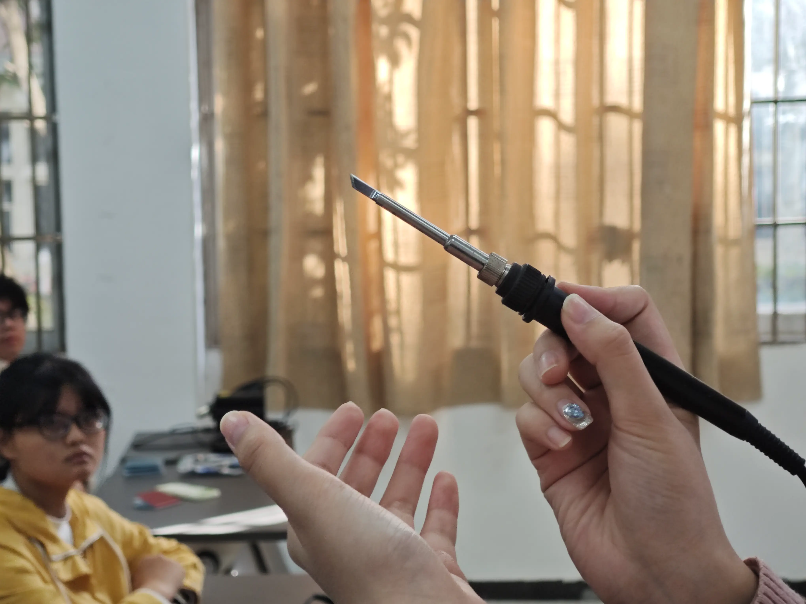
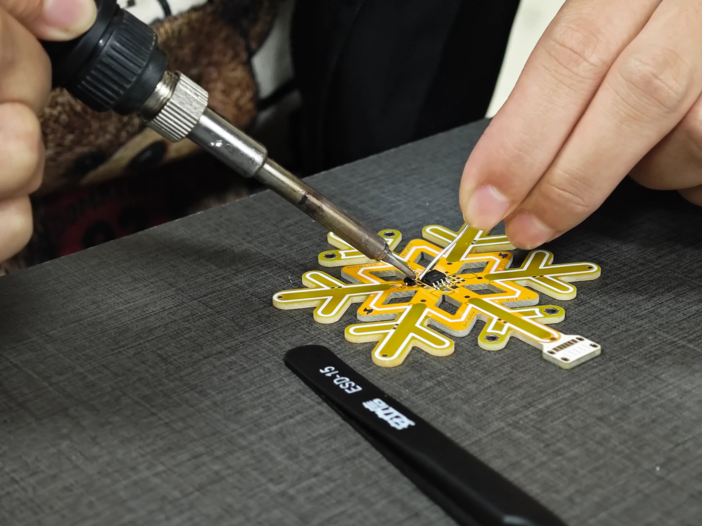
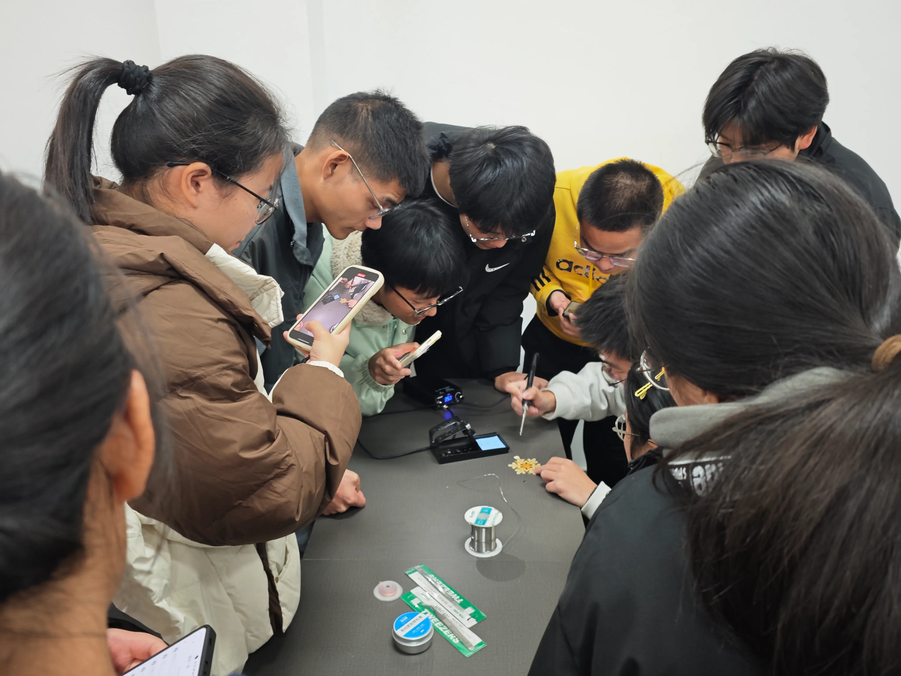
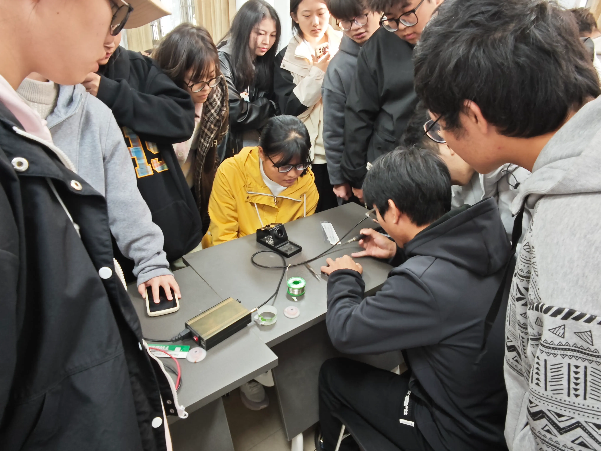
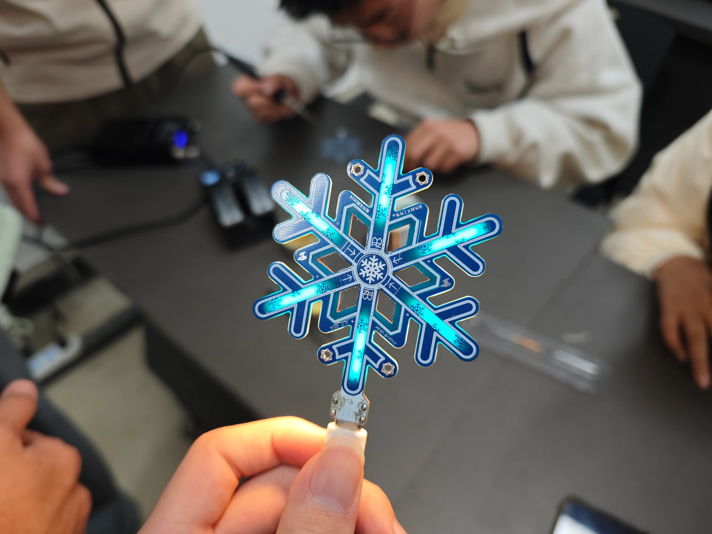
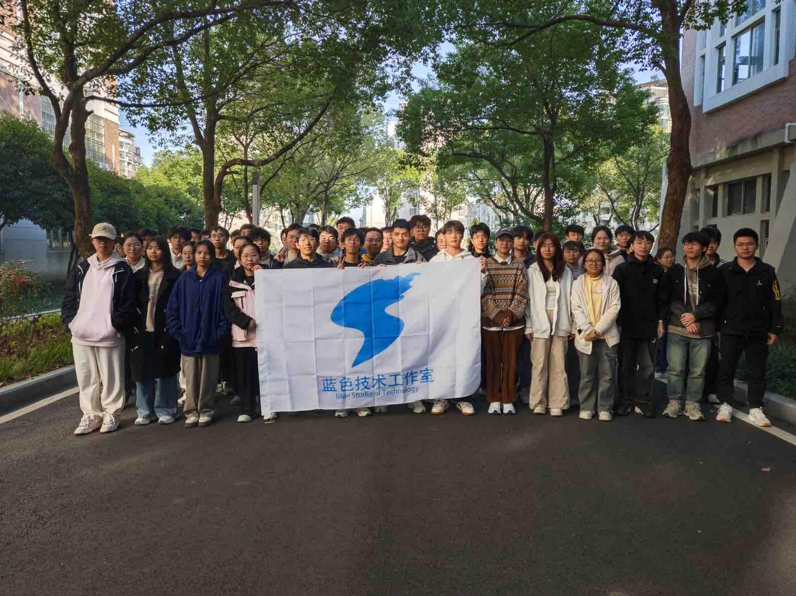

# 冬日入怀，雪花灯暖——锡焊技术实践课

❄️ 蓝色技术工作室于 11 月 29 日下午开展的锡焊技术实践课，让大家实践操作制作雪花灯，用一种独特的方式感受冬季的到来，共赴一场冬日的暖阳。

## 过程——技术理论，实践绽放

本次实践课通过锡焊技术的学习，带领大家探索电子电路的奥秘，为进一步学习和创新打下基础。

锡焊是一种广泛应用于电子制造中的基础技术，它通过熔化锡焊材料将电子元件固定在电路板上，实现电子电路的连接和稳定。

电路板则是现代电子产品的核心组件，为各种元件提供连接和支撑，是将创意转化为实际功能的关键平台。

每一盏雪花灯的诞生，都是同学们实践力与耐心的体现，亲手制作的雪花灯也成为了大家冬日美好回忆的象征。

活动接近尾声时，各小组分别展示了他们精心制作的雪花灯。现场的氛围温暖而热烈，大家不仅收获了精美的作品，更体验到了动手实践的乐趣与成就感。

成果展示：

## 评价——动手乐趣，满满收获

这次活动不仅增强了同学们的动手能力，更让大家在合作与交流中建立了深厚的友谊。团队合作、相互学习、共同成长，都是本次活动带给大家的宝贵收获。

## 结语——冬日印记

感谢所有参与者的热情投入，在这片冬日暖阳下，我们的每一次相遇都将成为温暖心田的回忆，期待在未来的活动中与大家再度相遇，共同创造更多难忘的记忆！

