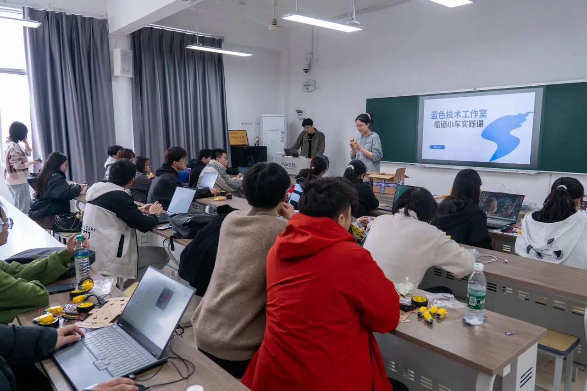
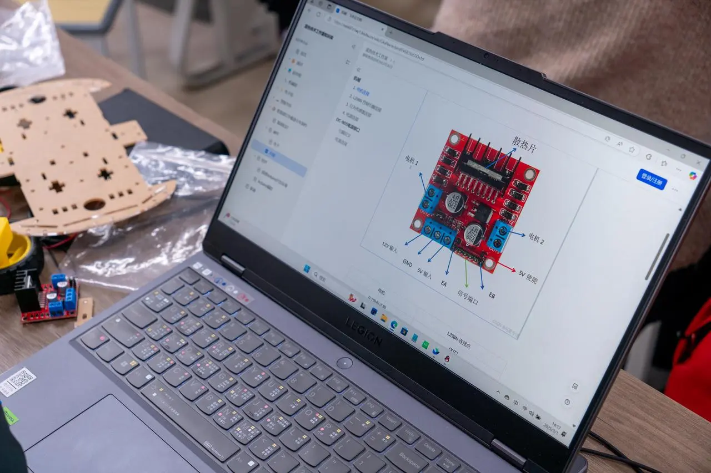
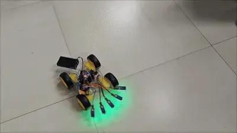

# 🚘循迹小车设计与实践

2025年3月1日下午，蓝色技术工作室举办的“循迹小车设计与实践”活动在J10-307教室圆满落下帷幕。从零基础到亲手组装小车，同学们在活动中深入学习了循迹小车的原理、构造以及编程技巧。让小车能够沿着预定的轨迹自如行驶。这次活动不仅是一次技术的探索，更是一次团队协作与创新思维的实践。每一位参与者都在动手实践中感受到了科技的魅力。

## 🎓**从理论到实践，点亮创意**

活动初始，大家通过简单易懂的讲解，掌握了循迹小车的基本构造与工作原理，并亲自体验了如何在编程和电路搭建中让小车“活”起来。

在学长、学姐们的悉心指导下，大家满怀热情地动手组装并调试小车。尽管大多数人都是初次接触，但每个人都充满了好奇与干劲，耐心细致地完成每一个步骤。

## 💡 **挑战与乐趣并存**

尽管遇到了一些小挑战，但同学们始终保持着积极的心态，齐心协力，互相帮助。无论是面对复杂的线路连接，还是调试中出现的意外问题，大家都毫不气馁，耐心地寻找解决方案。最终，在团队的共同努力下，循迹小车沿着预定的轨迹轻盈前行。

## 结语

实践创新不仅需要认真严谨的态度，还需要大胆尝试的精神。这次活动不仅让大家体验了动手制作的乐趣，也为后续项目打下了坚实基础。期待未来与大家再度相遇，共同创造更多精彩！

